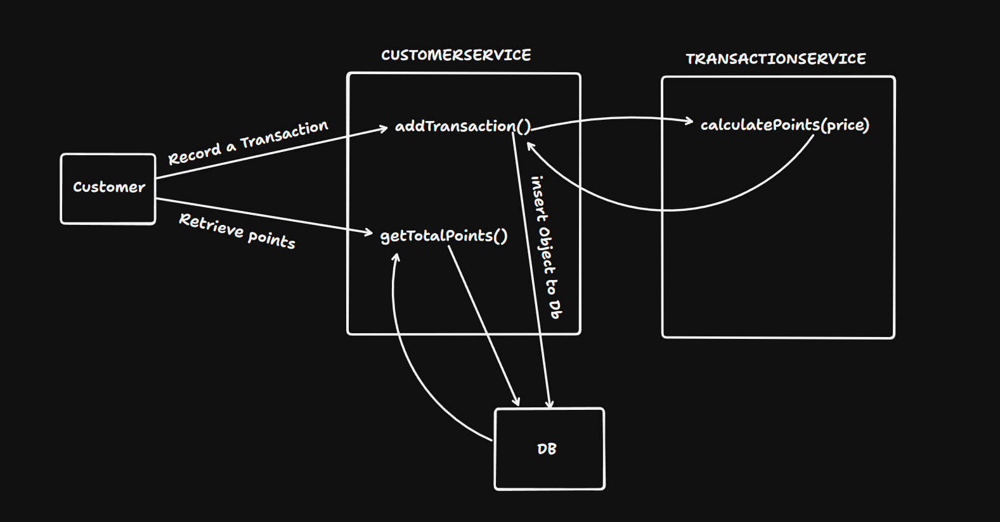

# Central Perk Reward System

## Overview

This project provides a conceptual overview and documentation for the Central Perk coffee shop's reward system. It includes the architecture explanation, data model diagram, and instructions for running the application.

## Architecture and Design Decisions

The project consists of frontend and backend components:

- **Frontend**: The user interface is developed using React.js with Typescript and MaterialUI for a responsive and intuitive dashboard. It interacts with the backend via RESTful APIs.

  - **Dashboard**: Displays customer information, points balance. It also allows the Gunther to see how many points has been earned and redeemed.

  - **Customer Details**: Shows the customer's name, email, and total points earned. It also lists the transactions made by the customer.

  - **Responsive Design**: The frontend is designed to be responsive and mobile-friendly, ensuring a consistent user experience across devices.

- **Backend**: The backend system utilizes a layered architecture with a focus on scalability and maintainability:

  - **Presentation Layer**: The API endpoints are designed using Java with Spring Boot framework, facilitating robust handling of HTTP requests and responses.

  - **Service Layer**: Implements business logic for transaction recording, points calculation, and customer management.

  - **Data Access Layer**: Integrates with MySQL database to persist customer, transaction and points data.

  - **Validation**: Utilizes Java Bean Validation API to enforce data integrity and validate input parameters.

## Data Model Diagram


The data model diagram illustrates the database schema for the reward system. It consists of three tables: `customer`, `transaction` and `points`. The `customer` table stores customer information such as id, name, email, and total points earned and redeemed. The `transaction` table records transaction details, including id, amount, date, earned points, and the customer id as a foreign key. The `points` table stores the points earned and redeemed by the customer, along with the userId id as a foreign key.

## Class Diagram


This diagram illustrates the class structure of the reward system. The Customer class represents the customer entity, which has attributes such as id, name, email, and points. The Transaction class represents the transaction entity, which has attributes such as id, amount, date, and earned points. The Points class represents the points entity, which has attributes such as id, and count. The CustomerService class provides methods to manage customer data, while the TransactionService class handles transaction-related operations and points class manages the points data.

## Use Case Diagram


The use case diagram outlines the interactions between Gunther and the reward system. Gunther can view customer details, including their name, email, and total points earned. He can also record new transactions, calculate the reward points, and save the transaction details in the database. Additionally, Gunther can text the customer about new offers and promotions.

## Sequence Diagram



This diagram shows how a customer's transaction is processed in the reward system. When a customer makes a purchase, the transaction is recorded by the CustomerService. It then calculates the reward points through the TransactionService and saves the transaction details, including the earned points, into the database.

## API Endpoints


This diagram showcases the API endpoints for the reward system. The frontend, built with React, sends requests to the backend Spring Boot API, which validates the data before interacting with the MySQL database. Depending on the validation outcome, the API responds with either a 200 OK or a 400 Bad Request.

## Running the Application

To run the application, follow these steps:

1. Clone the repository:

   ```bash
   git clone https://github.com/Hicham-BelHoucin/central-park.git
   ```

2. Navigate to the project directory:

   ```bash
   cd central-perk
   ```

3. create .env file in the root directory and add the following environment variables:

   ```bash
   REACT_APP_API_URL=https://fakestoreapi.com
   ```

4. Start the frontend server:

   ```bash
    npm install
    npm run start
   ```

5. Open the browser and navigate to `http://localhost:3000` to access the application.
